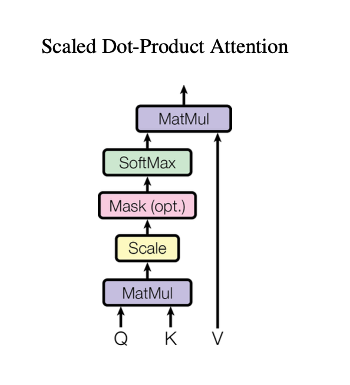
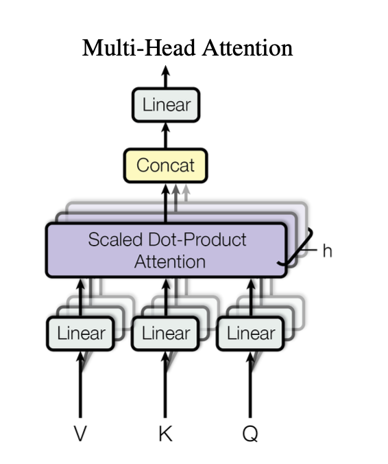
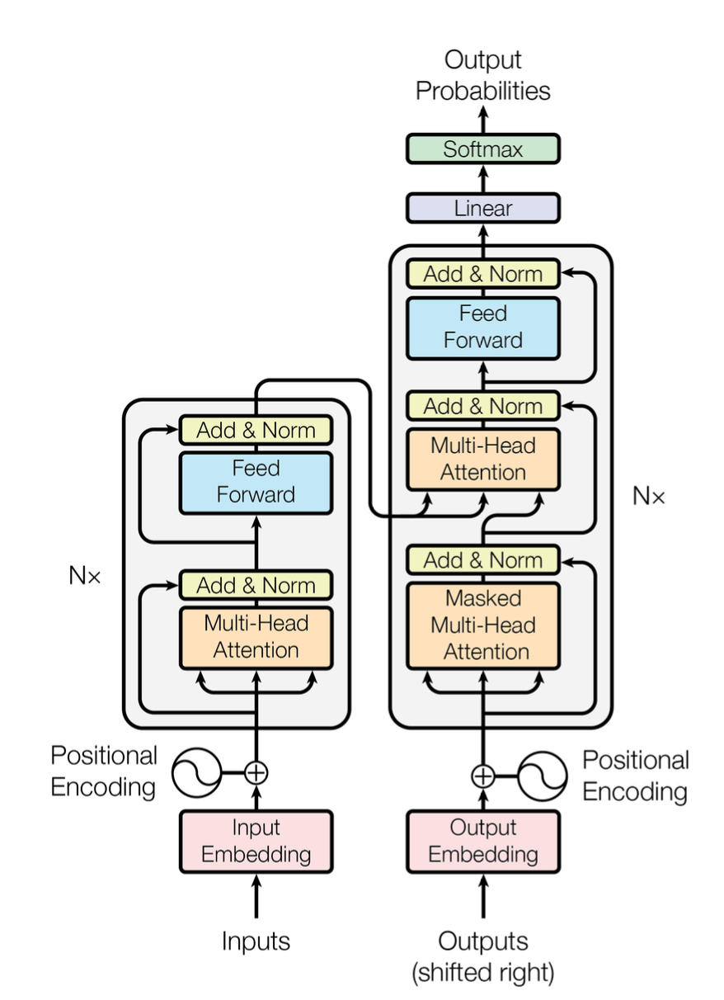

# Attention Is All You Need

## Introduction

The paper introduces a revolutionary neural network architecture known as the Transformer. This architecture is uniquely based on self-attention mechanisms, eliminating the need for recurrent neural networks (RNNs) and convolutions entirely.

## Attention Mechanism

### Attention Function
- The attention function takes in three inputs: **query** ($Q$), **key** ($K$), and **value** ($V$). And the output is a weighted sum of the values, where the weights are computed based on dot product between the **query** and **key**. 
$$\text{Attention}(Q, K, V) = \text{softmax} \left( \frac{QK^T}{\sqrt{d_k}} \right)V
$$

- Here, the scaling factor $$\frac{1}{\sqrt{d_k}}$$ normalizes the dot products to prevent large values.

Here is a diagram of the dot product attention:

### Multi-Head Attention
- To attend to information from different representation subspaces:
  - Transformer uses multi-head attention, which computes multiple attention scores (8 heads in the paper).
  - Each head computes attention scores independently, then concatenates and linearly projects to the original dimension.

Here is a diagram of the multi-head attention:

## Applications of Attention in the Transformer

### Encoder-Decoder Attention
- In the decoder, the queries come from the previous decoder layer, while the keys and values come from the output of the encoder. This allows every position in the decoder to attend over all positions in the input sequence.

### Self-Attention in Encoder and Decoder
- Both the encoder and decoder use self-attention layers to process their input sequences. In self-attention, the keys, values, and queries are all derived from the same input sequence.

## Visualization of Transformer Architecture

Here is a representation of the Transformer architecture:

